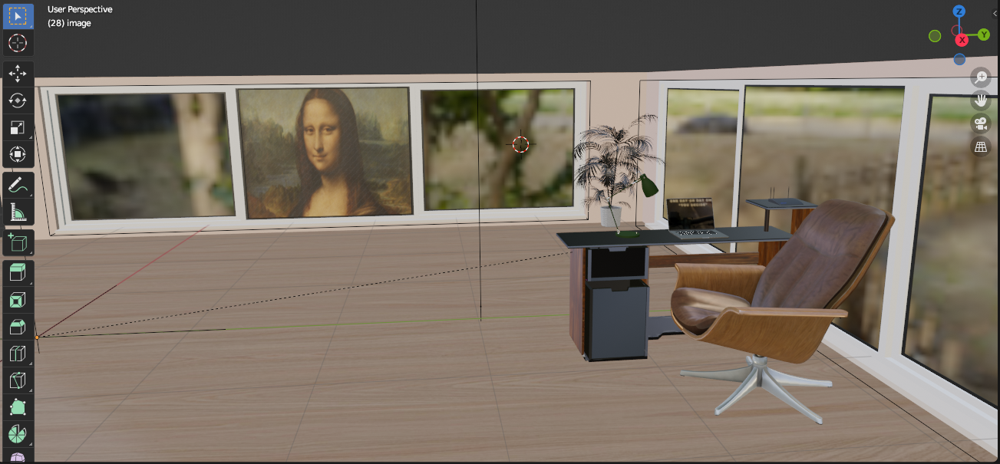

# 🪑 Office Desk — 3D Environment Module

> A photorealistic 3D interior scene built with **Blender**, featuring a modern office workspace with high-quality PBR textures and realistic lighting.

---

## 📸 Preview



---

## 🎯 About the Project

This project is a detailed **3D office environment** modeled and rendered in Blender. It showcases a cozy, mid-century modern workspace including:

- 🖥️ A sleek office desk with laptop and accessories
- 🪑 A mid-century lounge chair with realistic wood & leather textures
- 🪴 Indoor plants for a natural, warm atmosphere
- 🖼️ Wall art frames (including *Mona Lisa* as a reference piece)
- 🪟 Large panoramic windows with outdoor background
- 🗄️ A dark storage cabinet beside the desk

---

## 🛠️ Built With

| Tool | Purpose |
|------|---------|
| **Blender 3D** | Main 3D modeling & rendering software |
| **PBR Textures (Poliigon)** | High-quality physically based materials |
| **Cycles / EEVEE** | Photorealistic render engines |

---

## 📁 Project Structure

```
3D module/
├── uploads_files_3629878_office+desk.blend    # Main Blender project file
├── uploads_files_3629878_office+desk.blend1   # Blender auto-backup
├── preview.png                                # Scene preview screenshot
└── images/
    ├── mid_century_lounge_chair_diff_4k.jpg   # Chair diffuse texture (4K)
    ├── wood_cabinet_worn_long_diff_4k.jpg     # Cabinet wood texture (4K)
    ├── Poliigon_WoodVeneerOak_7760_BaseColor.jpg     # Oak veneer texture
    ├── Poliigon_PlasticMoldWorn_7486_BaseColor.jpg   # Plastic texture
    ├── Poliigon_PlasticMoldWorn_7486_Preview1.png    # Plastic preview
    ├── Mona-Lisa.jpg                          # Wall art reference
    └── 5h.png                                 # Additional texture
```

---

## 🚀 Getting Started

### Prerequisites

- [Blender](https://www.blender.org/download/) **3.x** or higher (free & open source)

### Open the Project

1. Download or clone this repository
2. Open **Blender**
3. Go to `File > Open` and select `uploads_files_3629878_office+desk.blend`
4. All textures are linked from the `images/` folder — make sure to keep the folder structure intact

> ⚠️ If textures appear missing, go to `File > External Data > Find Missing Files` and point to the `images/` directory.

---

## 🎨 Textures & Assets

All textures used in this project are sourced from **[Poliigon](https://www.poliigon.com/)** — a premium PBR texture library. Ensure you comply with their licensing terms for any commercial use.

---

## 📄 License

This project is for **educational and portfolio purposes** only.  
Textures belong to their respective owners (Poliigon, etc.).

---

## 👤 Author

**[Your Name]**  
3D Artist & Designer  

[](https://github.com/yourusername)
[](https://yourportfolio.com)

---

<p align="center">Made with ❤️ and Blender 🟧</p>
